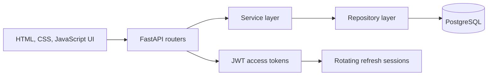

# Workout Tracker v3

[](https://github.com/px9122098-gif/workout.tracker_v3/actions/workflows/ci.yml)
[](https://www.python.org/)
[](https://fastapi.tiangolo.com/)
[](https://www.postgresql.org/)

A deployed full-stack workout journal for recording training sessions and turning
them into useful progress analytics. The project covers the complete delivery
cycle: backend architecture, authentication, database migrations, automated
tests, responsive frontend, CI, and cloud deployment.

**[Live application](https://workout-tracker-v3.onrender.com/)** |
**[Interactive API docs](https://workout-tracker-v3.onrender.com/docs)** |
**[Health check](https://workout-tracker-v3.onrender.com/api/health)**

> The demo runs on Render and may need a short warm-up after a period of inactivity.

## What the application does

- Registers users and protects private training data.
- Creates, edits, completes, filters, and deletes workouts.
- Stores session notes, exercises, sets, and perceived effort.
- Prevents exercises and sets from being changed after workout completion.
- Shows weekly totals, recent workouts, a configurable goal, and a personal best.
- Calculates training volume, consistency, estimated 1RM, and personal records.
- Presents responsive dashboard, workout history, detail, and progress views.
- Keeps sessions active with short-lived access tokens and rotating refresh sessions.

## Architecture

The backend follows a layered structure so that HTTP handling, business rules,
and database access can evolve independently.



Typical request flow:

1. A router validates the incoming request and resolves the current user.
2. A service applies business rules and coordinates the use case.
3. A repository performs SQLAlchemy queries scoped to that user.
4. A Pydantic response model defines the public API contract.

## Technology stack

| Area | Technologies |
| --- | --- |
| Backend | Python 3.12, FastAPI, Pydantic |
| Data | PostgreSQL, SQLAlchemy, Alembic, psycopg |
| Authentication | JWT access tokens, rotating refresh sessions, HttpOnly cookies |
| Frontend | Semantic HTML, modular CSS, vanilla JavaScript, SVG charts |
| Testing | pytest, FastAPI TestClient, isolated SQLite test database |
| Delivery | GitHub Actions, Render Blueprint, Uvicorn |

## Project structure

```text
app/
|-- api/v1/          # HTTP routes and response contracts
|-- repository/      # Database queries
|-- service/         # Business logic
|-- static/          # Modular frontend assets
|-- config.py        # Environment-based settings
|-- dependency.py    # Database and authentication dependencies
|-- models.py        # SQLAlchemy models
`-- schemas.py       # Pydantic schemas
alembic/             # Versioned database migrations
tests/               # Auth, workout, exercise, set, progress, and system tests
main.py              # Application composition and static frontend mount
render.yaml          # Render infrastructure definition
```

## Local setup

### 1. Create the environment

```powershell
python -m venv .venv
.\.venv\Scripts\Activate.ps1
python -m pip install -r requirements.txt
```

### 2. Configure the application

Copy `.env.example` to `.env` and provide your local PostgreSQL connection and
a strong random `SECRET_KEY`.

```powershell
Copy-Item .env.example .env
```

Important settings:

| Variable | Purpose |
| --- | --- |
| `DATABASE_URL` | SQLAlchemy connection URL |
| `SECRET_KEY` | Signs access and refresh tokens |
| `ACCESS_TOKEN_EXPIRE_MINUTES` | Access-token lifetime |
| `REFRESH_TOKEN_EXPIRE_DAYS` | Refresh-session lifetime |
| `COOKIE_SECURE` | Must be `true` when served over HTTPS |
| `APP_TIMEZONE` | Time zone used for reporting periods |
| `CORS_ORIGINS` | Allowed browser origins |

Never commit `.env` or production credentials.

### 3. Prepare the database and run the app

Create the database named in `DATABASE_URL`, then apply all migrations:

```powershell
alembic upgrade head
uvicorn main:app --reload
```

Open `http://127.0.0.1:8000`. API documentation is available at
`http://127.0.0.1:8000/docs`.

## API overview

All application endpoints are versioned under `/api/v1`.

| Resource | Main operations |
| --- | --- |
| Authentication | register, login, refresh, logout, current user |
| Workouts | CRUD, detail, completion, monthly overview |
| Exercises | create, update, delete |
| Sets | create, update, delete |
| Progress | overview, exercise options, strength history, personal records |

Protected endpoints require an access token. The refresh token is stored in an
HttpOnly cookie scoped to the authentication API and is rotated after use.

## Tests and CI

The current suite contains **57 automated tests**. Tests override the production
database dependency with an isolated SQLite database, so test data never reaches
PostgreSQL.

```powershell
python -m pytest -q
```

GitHub Actions runs the same suite on every push and pull request using Python
3.12. This checks authentication, ownership boundaries, completed-workout rules,
analytics, and the main API workflows.

## Security decisions

- User ownership is enforced by backend queries, not by hidden frontend elements.
- Passwords are stored as hashes rather than plaintext.
- Access tokens are short-lived; refresh sessions are persisted and rotated.
- Refresh cookies are HttpOnly, `SameSite=Lax`, and secure in production.
- Completed workouts are immutable at the exercise and set layers.
- Secrets are supplied through environment variables and excluded from Git.

## Deployment

`render.yaml` describes the Render web service and managed PostgreSQL database.
The deploy command applies Alembic migrations before starting Uvicorn, and Render
uses `/api/health` to verify the service.

To deploy your own copy:

1. Fork or clone the repository and push it to GitHub.
2. Create a new Render Blueprint from the repository.
3. Review the generated web service, database, and environment variables.
4. Apply the Blueprint and wait for migrations and the health check to finish.

Free hosting plans may sleep, limit resources, or change retention policies.
Check the current provider terms before storing important data.

## Status and roadmap

Version 3 is a deployed portfolio release with complete workout tracking,
analytics, authentication, responsive views, tests, and CI.

Possible next steps:

- React frontend with reusable components and client-side routing.
- Guest mode with an idempotent account-import flow.
- Email verification and password recovery.
- Reusable workout programs and an exercise catalogue.
- Dark theme, accessibility audit, monitoring, and production observability.

## Author

Built as an independent full-stack project by **Alexander Smirnov** while studying
backend engineering and product delivery.
